# 携程评价下单人显示插件学习沉淀

## 资料状态

| 项 | 结论 |
| --- | --- |
| 来源 | `D:/AIOS/ai插件/携程的评价显示下单人/v0.0.6.zip` |
| 文件类型 | Chrome MV3 / Plasmo 浏览器扩展包 |
| 版本 | `0.0.6` |
| SHA256 | `9517E6A839BA48E1C0EAB4CB8641ADDBB6A1E41082AE21308670DDDC5D4DAE0C` |
| 学习时间 | 2026-06-29 |
| 验证状态 | `user_provided_unverified`，仅静态阅读，未安装、未登录、未访问携程后台 |
| 项目边界 | 只沉淀学习材料；不新增业务表、不修改 OTA 采集主线、不把页面字段当作全酒店经营事实 |

## 插件做了什么

该扩展用于携程 eBooking 后台，目标是把评论页里展示的用户名与 IM 会话成员信息匹配，从而在评论用户名旁显示可识别的下单人/成员昵称。

核心不是直接读取评论接口，而是两段式：

1. 在携程 IM 页采集聊天列表与成员表。
2. 在携程评论页读取用户名，通过 UID/用户名匹配，把昵称写回页面旁边。

## 扩展权限和页面范围

| 项 | 静态证据 |
| --- | --- |
| 页面范围 | `https://ebooking.ctrip.com/*`、`https://ebooking.ctrip.com/comment/*` |
| 权限 | `scripting`、`tabs`、`storage`、`webNavigation`、`downloads` |
| 后台脚本 | `static/background/index.js` |
| IM 页内容脚本 | `plasmo.498f7030.js` |
| 评论页内容脚本 | `comment-matcher.e47c142f.js` |
| 数据查看页 | `tabs/data.html` + `tabs/data.b7cd4d1f.js` |
| 远端能力 | Supabase 登录、VIP/设备绑定、版本更新、远端同步 |

## 关键选择器和常量

插件把选择器做了简单异或混淆，静态解码结果如下：

| 常量 | 值 | 用途 |
| --- | --- | --- |
| `S_STORAGE_KEY` | `collected_data` | 本地保存采集数据 |
| `S_API_TARGET` | `queryMessageListByGroupId` | IM 成员接口目标之一 |
| `S_MSG_INTERCEPTED` | `INTERCEPTED_MEMBERS` | 页面消息类型 |
| `S_DOMAIN` | `ebooking.ctrip.com` | 注入范围 |
| `S_SEL_GROUP_ITEM` | `[class*="groupItem"]` | IM 聊天列表项 |
| `S_SEL_GROUP_TITLE` | `[class*="groupTitle"]` | IM 会话名称 |
| `S_SEL_GROUP_AVATAR` | `[class*="groupAvatar"] img, img[class*="groupAvatar"]` | 会话头像 |
| `S_SEL_TIME_FORMAT` | `[class*="timeFormat"]` | 会话时间 |
| `S_SEL_ORDER_STATUS` | `[class*="orderStatusTag"]` | 订单/入住状态标签 |
| `S_ATTR_GROUPID` | `data-groupid` | 会话 groupId |
| `S_SEL_USERNAME` | `div.row.u3p7kqv` | 评论页用户名容器 |
| `S_FILTER_KEFU` | `智能客服` | 过滤系统客服 |
| `S_FILTER_IMK` | `IMK` | 过滤 IMK 前缀成员 |
| `S_DEVICE_KEY` | `device_fingerprint` | 设备绑定 |

## 数据流

```mermaid
flowchart LR
  A["携程 eBooking IM 页"] --> B["读取聊天列表 DOM: groupId/name/avatar/date/status"]
  B --> C["点击会话触发 IM 请求"]
  C --> D["拦截 XHR/fetch: queryMessageListByGroupId / queryMessageListV2"]
  D --> E["提取 response.members 或 response.result.members"]
  E --> F["保存 collected_data: groupId -> members"]
  F --> G["携程评论页"]
  G --> H["读取评论用户名 div.row.u3p7kqv"]
  H --> I["明文/脱敏候选用户名 -> MD5"]
  I --> J["MD5 命中 members UID"]
  J --> K["页面显示: -> nickName"]
```



## IM 采集结构

单条会话采集对象大致为：

```json
{
  "groupId": "携程IM会话ID",
  "name": "会话名称",
  "avatar": "头像 URL",
  "date": "列表时间",
  "status": "订单/入住状态文本",
  "checkDate": "从状态文本提取的入住/离店日期",
  "members": {
    "uid_or_hash": {
      "uid": "成员 UID",
      "nickName": "成员昵称",
      "avatar": "成员头像"
    }
  }
}
```

插件支持：

- 全量采集。
- 增量采集：连续 5 条已有 `groupId` 且已有 `members` 时自动停止。
- 暂停、继续、取消。
- 本地 JSON/CSV 下载。
- `groupId` 去重保存。
- 本地 `chrome.storage.local` 保存，登录后可同步到 Supabase `collected_items`。

## 评论页匹配逻辑

评论页内容脚本读取 `div.row.u3p7kqv` 下的用户名文本：

1. 先从后台取全部已采集 `members`。
2. 过滤 `智能客服` 和 `IMK` 开头成员。
3. 对评论页用户名生成候选：
   - 明文用户名：尝试首字母大小写、全小写等变体。
   - 脱敏用户名：若形如 `xxx****`，先去掉 `****`，再枚举尾部 4 位候选。
   - 数字尾号场景枚举 `0000` 到 `9999`。
   - 字母结尾场景枚举 `0-9a-z` 的 4 位组合。
4. 对候选用户名做 MD5，与 `members` 的 UID key 对照。
5. 命中后在页面用户名旁添加 `member-match-result`，显示 `-> nickName`。
6. 登录远端账号时，把匹配记录 upsert 到 Supabase `comment_match_logs`。

匹配记录字段：

| 字段 | 含义 |
| --- | --- |
| `source_username` | 评论页展示用户名 |
| `matched_candidate` | 插件推测出的完整候选用户名 |
| `matched_uid` | 候选用户名 MD5 |
| `nick_name` | 命中的成员昵称 |
| `page_url` | 评论页 URL |
| `match_type` | `direct` 或 `masked` |

## 可学习价值

| 价值点 | 对宿析OS的启发 |
| --- | --- |
| 先从 IM 成员表补齐评论身份线索 | 评论运营可增加“评价用户身份线索”辅助，不应直接作为经营指标 |
| 两段式采集 | 先建成员证据表，再做评论页匹配，比在评论页硬猜更可追溯 |
| 显式采集状态 | 检测、点击、等待、成功、跳过、超时、取消都应显示状态 |
| 去重与增量 | `groupId` 可作为幂等键，连续已有记录可停止增量采集 |
| 数据导出 | JSON/CSV 可作为人工核验和离线导入材料 |
| 匹配结果写回页面 | 可作为浏览器辅助能力，不等于系统主数据 |

## 不适合直接吸收的部分

| 风险 | 原因 |
| --- | --- |
| 直接安装或运行该扩展 | 含远端 Supabase 登录、设备绑定、更新通道，未做安全审计 |
| 直接复用远端同步 | 外部 Supabase 表、账号体系、VIP 逻辑不属于宿析OS |
| 保存明文密码 | 插件可把 `saved_credentials.email/password` 写入 `chrome.storage.local` |
| 反调试/反自动化代码 | 包含禁用 console、拦截 F12/右键、检测自动化、清空 storage/DOM 等逻辑，不适合项目主线 |
| DOM class 选择器 | `[class*="groupItem"]`、`div.row.u3p7kqv` 对携程前端改版敏感 |
| 脱敏用户名枚举 | 可能耗时，且匹配假设需验证；不能把推测结果当成官方事实 |
| 采集头像/昵称 | 可能涉及个人信息或平台账号信息，必须按授权和脱敏边界处理 |

## 宿析OS建议沉淀方式

当前只作为“授权浏览器辅助采集样本”，不进入业务主线。若后续要吸收，应按补充合同处理：

| 层级 | 建议 |
| --- | --- |
| 业务范围 | 仅限携程 OTA 评论/IM 辅助运营，不进入全酒店经营指标 |
| 采集入口 | 用户授权的浏览器 Profile，手动触发，保留登录失效/页面缺字段/选择器失配状态 |
| 数据状态 | `user_provided_unverified` -> `browser_session_verified` -> `operator_confirmed`，逐步升级 |
| 存储目标 | 先用文档和脱敏 fixture；确需系统化时再设计 `raw_data` 或知识块，不直接新建业务表 |
| 证据合同 | `source_platform`、`source_page`、`group_id`、`selector_or_path`、`field_key`、`field_status`、`collected_at`、`confidence` |
| 匹配结果 | 明确区分 `direct_match`、`masked_candidate_match`、`not_matched`、`not_loaded`、`selector_missing` |
| 验证方式 | 用脱敏 HTML/JSON fixture 做解析器测试，再用授权浏览器人工核验 |

## 推荐后续动作

1. 暂不安装、不运行该扩展。
2. 若要继续吸收，先让用户确认是否有携程 eBooking 授权账号和可用于脱敏的 IM/评论样本。
3. 建一个宿析OS原生的“携程评论身份辅助证据合同”，不要复用外部 Supabase、账号体系、反调试逻辑。
4. 优先做离线 fixture 解析器和字段清单，再决定是否接入浏览器 Profile 采集。

## 结论

这份插件对宿析OS有参考价值，但当前价值是“方法学习”，不是可直接并入主线的功能包。

可吸收的是：携程 IM 成员表 -> 评论用户名匹配 -> 评论运营辅助的证据链。

不可直接吸收的是：外部账号/VIP/远端同步、明文密码保存、反调试保护、未验证的 DOM 选择器和脱敏枚举匹配结果。
