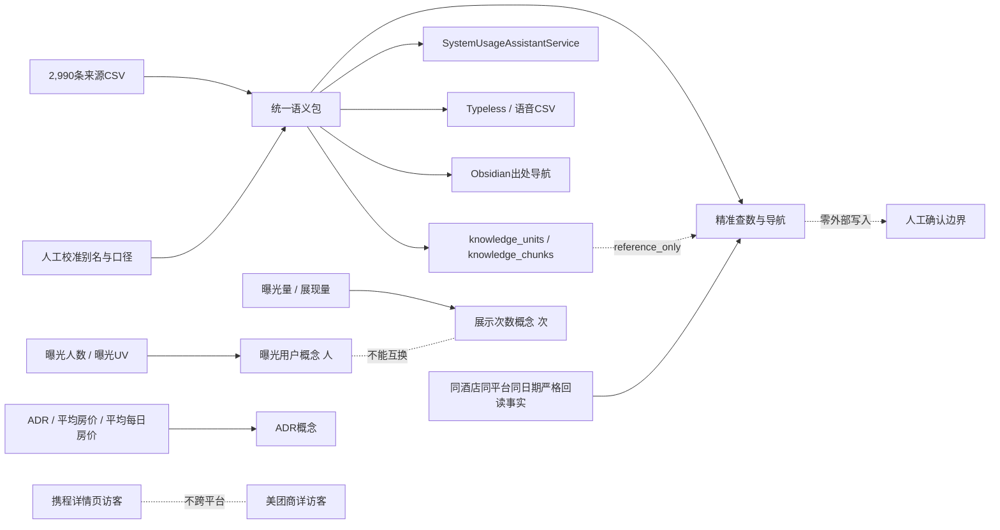

# 关系图

```mermaid
flowchart LR
  CSV[2,990条来源CSV] --> PACK[统一语义包]
  CUR[人工校准别名与口径] --> PACK
  PACK --> KC[knowledge_units / knowledge_chunks]
  PACK --> QUERY[精准查数与导航]
  PACK --> GUIDE[SystemUsageAssistantService]
  PACK --> VOICE[Typeless / 语音CSV]
  PACK --> OB[Obsidian出处导航]
  KC -. reference_only .-> QUERY
  FACT[同酒店同平台同日期严格回读事实] --> QUERY
  QUERY -. 零外部写入 .-> STOP[人工确认边界]

  EXPUV[曝光人数 / 曝光UV] --> EXPUVC[曝光用户概念 人]
  EXPIMP[曝光量 / 展现量] --> EXPIMPC[展示次数概念 次]
  EXPUVC -. 不能互换 .- EXPIMPC
  ADR[ADR / 平均房价 / 平均每日房价] --> ADRC[ADR概念]
  CTV[携程详情页访客] -. 不跨平台 .- MTV[美团商详访客]
```
